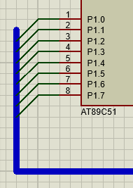

[Source Code](./proj.a51)

## Notes

### Proteus 中使用总线的目的

1. 在画数字电路时，需要对大量导线类型相同的数据和地址进行连线，这时就需要使用总线用以简单化电路图的连线.

2. 在复杂的电路图中使用总线，可以清晰快速的理解多连线元件间的关系。
   因为即使是自己设计绘制的电路图，时间间隔较长时，也会忘记。在读别人的电路图时也会因为总线的使用而加快理解速度.

### Proteus 的总线的绘制方法

1. 拐弯处 45deg 偏转（按住 Ctrl）

   

2. 选中属性赋值工具 LBL，按下 A 弹出面板，设置标号自动增量

## Result

