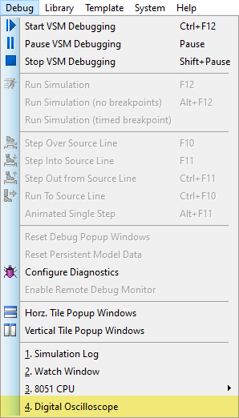
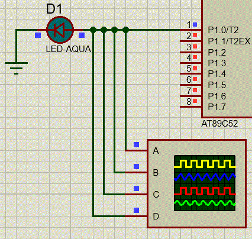
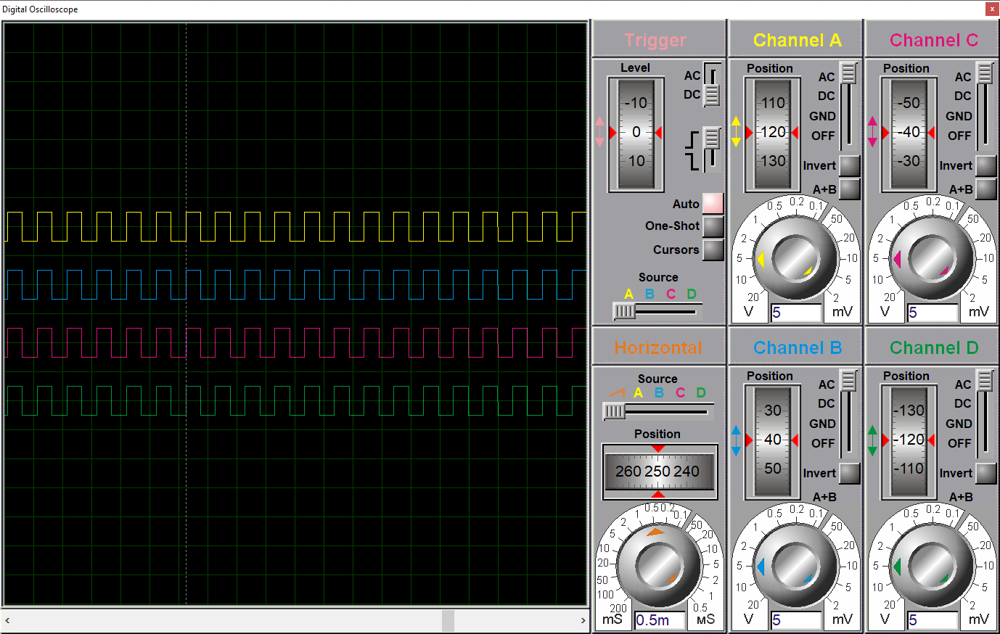

[Source Code](./proj.a51)

## Notes

- Timer Mode2 features a 8bit auto-refilling. Put refilling value in TH and init value in TL.

  ```
  MOV TMOD,#00100000B	;SET T1 M2 8-BIT-AUTO-REFILL
  MOV TH1,#0			;REFILL VALUE
  MOV TL1,#0			;INIT VALUE
  ```

- Call out the Oscillator Display through Debug-Oscillator.

  

- If the interruption processing snippet is small enough to fit into 8 btyes, it can be put right into the place of the corresponding int vector.

  ```
  ORG 00H
  SJMP MAIN
  ORG 1BH
  CPL P1.0	;8BYTE ENOUGH FOR INT PROCESSING
  RETI
  ```

## Result



